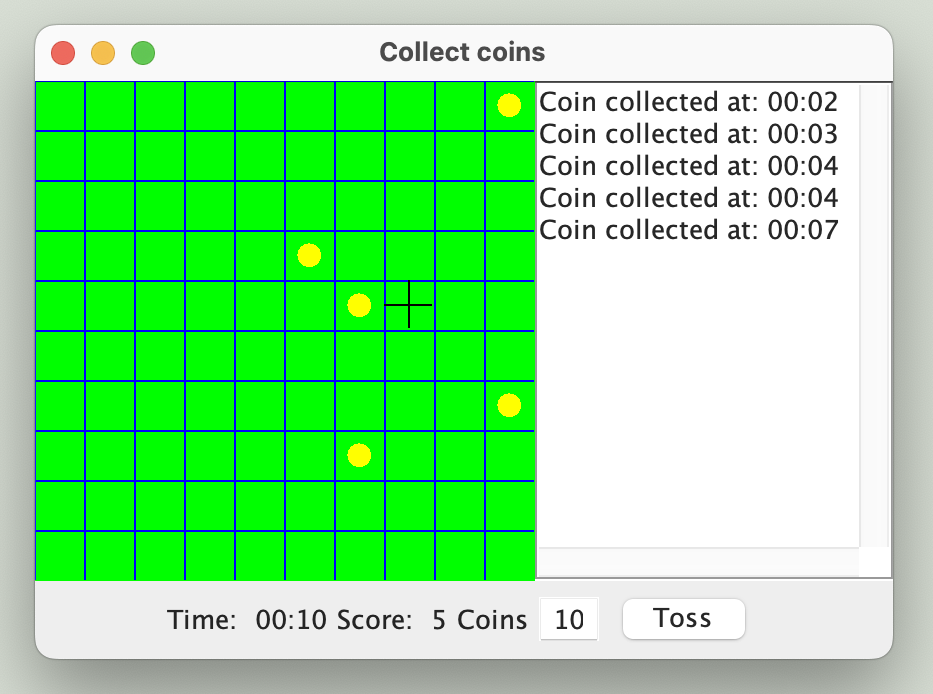

# Collect Coins Game

**Collect Coins** is an exciting arcade game where you control a character to collect coins while avoiding obstacles. The goal is to gather as many coins as possible before time runs out or you lose all your lives.

## How to Play

- Use the arrow keys to move the character.
- Collect as many coins as possible.
- Avoid obstacles to keep your lives.

## Features

- Simple and fun gameplay.
- Increasing difficulty with each level.
- Score tracking.

## Installation

1. Clone this repository:
   ```bash
   git clone PROJECT_URL

2. Navigate to the project directory:
   ```bash
   cd PROJECT_LOCATION

1. Compile and run the game:
   ```bash
   javac CollectCoins.java
   java CollectCoins

## 🖼️ Screenshot



